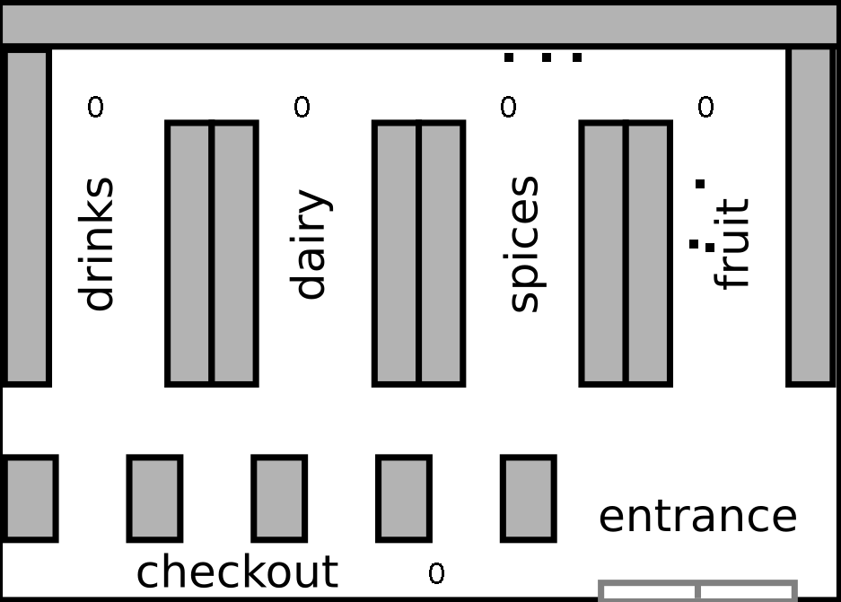

# Supermarket Simulation

This python program simulates and visualizes customer's behavior such as the amount of time and money they spend at each aisle by applying the Markov Chain and Monte-Carlo modeling. The simulation can be based on any day of the week or on the whole weekdays with a given number of customers.

## Usage:
python main.py

## Description:
The program starts by asking the user to enter the specific day of the week from Monday to Friday or 'all_days' (a simulation based on all days of the week) and then the number of customers. The Monte-Carlo simulation using Markov Chain will run based on the given data and the program visualizes the shopping pattern of the customers with the amount of money they spend at each aisle and finally the total income of the supermarket at the checkout section.

## Used tech and model:
 - Python
 - cv2
 - Numpy
 - Pandas
 - Markov Chain
 - Monte-Carlo

## Scripts:
- **main**: The main py file to run the program.

- **probability_matrix_and_array**: This module reads the CSV data and applies feature engineering in order to obtain
a probability matrix and arrays to define customer's pattern in the supermarket and the time they spend at each aisle.

- **supermarket_sim**: Includes the Customer class that generates the shopping pattern and payments based on the probability matrix and arrays from PorbabilityClass and SupermarketSim class that accept a list of customers made by Customers class and apply the movement in the shop for visualization.

## Licence:

Free software: MIT License
